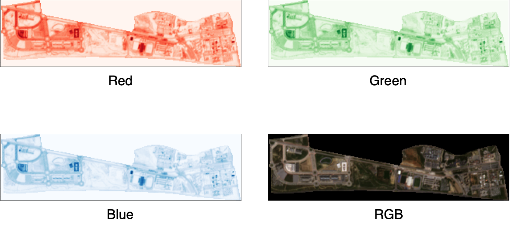

## green-senti _toolbox_

### Setup

Using Poetry:

```shell
$ poetry install
```

### Usage

```shell
$ greensenti --help
Usage: greensenti [OPTIONS] COMMAND [ARGS]...

Options:
  --install-completion [bash|zsh|fish|powershell|pwsh]
                                  Install completion for the specified shell.
  --show-completion [bash|zsh|fish|powershell|pwsh]
                                  Show completion for the specified shell, to
                                  copy it or customize the installation.

  --help                          Show this message and exit.

Commands:
  compute-index  Compute a plethora of remote sensing indexes.
  dhus-download  Downloads products from DHUS.
  product        Manage product storage.
  raster         Raster operations.
```

### Tutorial

##### Compute NDVI of El Ejido district (Málaga)

From Python:

```py
from greensenti.cli.compute_index import ndvi
from greensenti.cli.raster import apply_mask, transform_image

b04_masked = apply_mask(filename="examples/IMG_DATA/R10m/B04_10m.jp2", geojson="geojson/ejido.geojson", output="B04_10m_masked.jp2")
b08_masked = apply_mask(filename="examples/IMG_DATA/R10m/B08_10m.jp2", geojson="geojson/ejido.geojson", output="B08_10m_masked.jp2")
ndvi(b4=b04_masked, b8=b08_masked, output="ndvi.tiff")

transform_image("ndvi.tiff", output="ndvi.png")
```

From the CLI:

```shell
$ greensenti raster apply-mask --output B04_10m_masked.jp2 examples/B04_10m.jp2 geojson/ejido.geojson
$ greensenti raster apply-mask --output B08_10m_masked.jp2 examples/B08_10m.jp2 geojson/ejido.geojson
$ greensenti compute-index ndvi --help
Usage: greensenti compute-index ndvi [OPTIONS] B4 B8

  Compute Normalized Difference Vegetation Index (NDVI).
  
Arguments:
  B4  RED band (B04 for Sentinel-2, 10m)  [required]
  B8  NIR band (B08 for Sentinel-2, 10m)  [required]

Options:
  --output PATH  Output file
  --help         Show this message and exit.
$ greensenti compute-index ndvi --output ndvi.tiff B04_10m_masked.jp2 B08_10m_masked.jp2
index value: 0.21251319348812103
exported to: /Users/john/ndvi.tiff
$ greensenti raster transform-image --output ndvi.png --cmap RdYlBu ndvi.tiff
```


##### Compute true color of Teatinos Campus (University of Málaga)

```shell
$ greensenti raster apply-mask --output B02_10m_masked.jp2 examples/B02_10m.jp2 geojson/teatinos.geojson
$ greensenti raster apply-mask --output B03_10m_masked.jp2 examples/B03_10m.jp2 geojson/teatinos.geojson
$ greensenti raster apply-mask --output B04_10m_masked.jp2 examples/B04_10m.jp2 geojson/teatinos.geojson
$ greensenti compute-index true-color --output true-color.tiff B04_10m_masked.jp2 B03_10m_masked.jp2 B02_10m_masked.jp2
exported to: /Users/john/true-color.tiff
$ greensenti raster transform-image --output true-color.png true-color.tiff 
```


